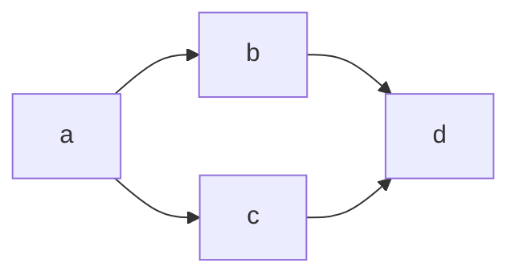

# Book examples

## Introduction

### Flowchart

```
flowchart LR
  a --> b & c --> d
```


Mermaid command line

```
mmdc -i path-to-your-mermaid-file.mmd -o output.png
```
## Document your domain
